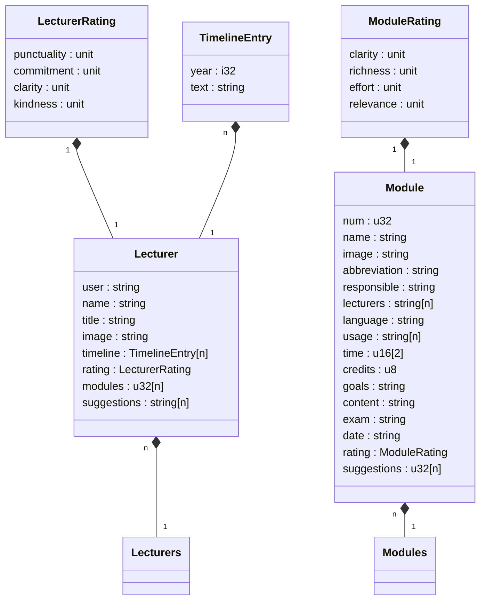

```mermaid
classDiagram
    LecturerRating "1" *-- "1" Lecturer
    ModuleRating "1" *-- "1" Module
    TimelineEntry "n" *-- "1" Lecturer
    Lecturer "n" *-- "1" Lecturers
    Module "n" *-- "1" Modules
    class LecturerRating{
      punctuality : unit
      commitment : unit
      clarity : unit
      kindness : unit
    }
    class ModuleRating{
      clarity : unit
      richness : unit
      effort : unit
      relevance : unit
    }
    class TimelineEntry{
      year : i32
      text : string
    }
    class Lecturer{
      user : string
      name : string
      title : string
      image : string
      timeline : TimelineEntry[n]
      rating : LecturerRating
      modules : u32[n]
      suggestions : string[n]
    }
    class Module{
      num : u32
      name : string
      image : string
      abbreviation : string
      responsible : string
      lecturers : string[n]
      language : string
      usage : string[n]
      time : u16[2]
      credits : u8
      goals : string
      content : string
      exam : string
      date : string
      rating : ModuleRating
      suggestions : u32[n]
    }
```
