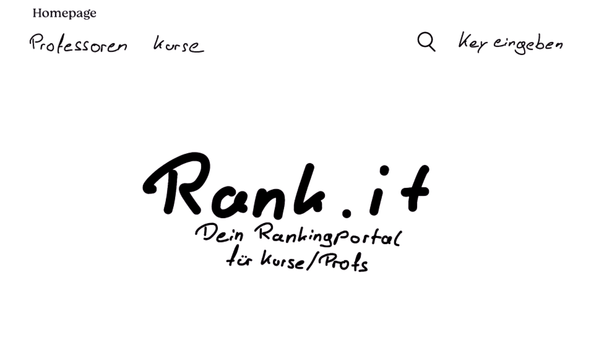
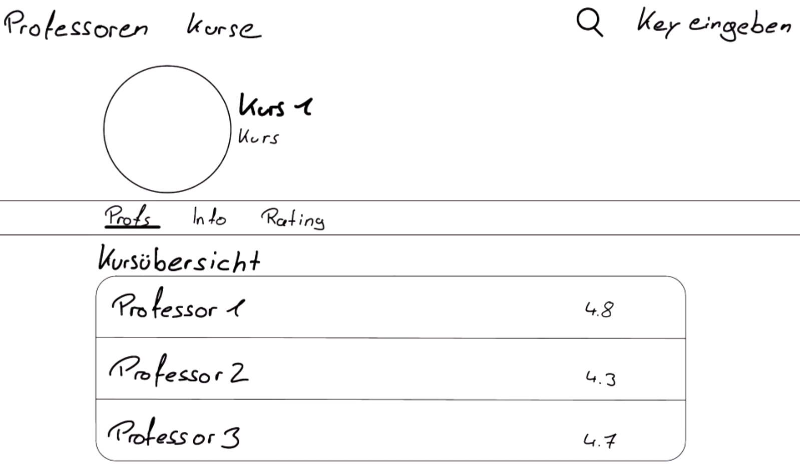
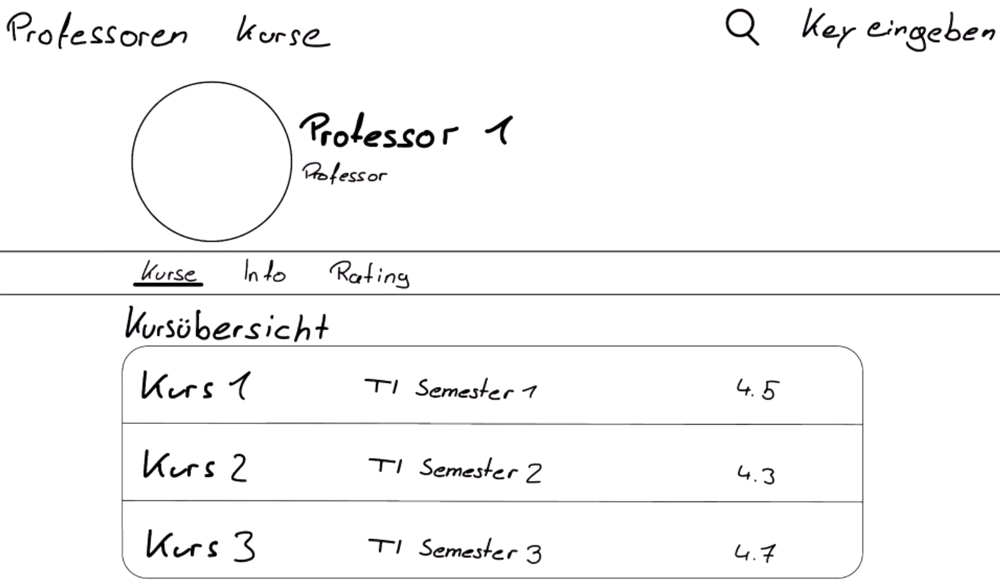
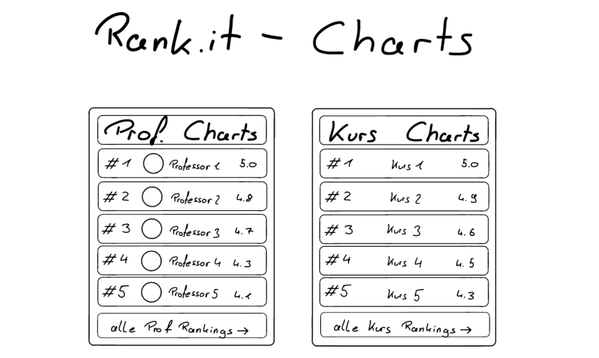

# Rank it - Dein Professoren-Punktierungs-Portal
_Ein Software-Design-Projekt von Dominik Sander und Tim Ernst_

## Einführung
Das Studienbewertungsportal ermöglicht den Studierenden die Bewertung ihrer Dozenten und Module.
Dies erleichtert Studieninteressierten die Auswahl eines passenden Studienverlaufs
und dient den Dozenten als Ansporn, das Beste aus sich herauszubekommen.

## Systemdesign

### Funktionsübersicht
Das Studienbewertungsportal als Ganzes zerfällt in mehrere Teile.
Jede Seite verfügt über einen Header, der die Navigation durch die verschiedenen Teile der Website erleichtert,
sowie einen Footer, der Kontaktinformationen des Betreibers und eine rechtliche Anmerkung enthält.

Es gibt eine Hauptseite, die eine Suchfunktion bereitstellt sowie eine Liste der jeweils 5 beliebtesten Dozenten und Module.
Darüber hinaus gibt es jeweils eine Seite, auf der alle Dozenten und Module aufgelistet sind, die nach verschiedenen Kriterien sortiert werden können.
Die Detailseite eines Dozenten zeigt Informationen über diesen an, wie etwa Name, Titel, Werdegang und Bewertungen.
Abgerundet wird die Seite durch die Möglichkeit, auf Basis von Vorschlägen zu ähnlichen Dozenten zu gelangen.
Die Detailseite eines Moduls zeigt Informationen über dieses an, wie etwa Name, den Verantwortlichen und Bewertungen.
Auch diese Seite wird über Vorschläge zu ähnlichen Modulen abgerundet.

### Integration von Angular
Wir haben Angular und TypeScript verwendet, um die Benutzeroberfläche zu gestalten.
Wir verwenden Firebase, eine NoSQL-Datenbank von Google, die auf JSON basiert.
Die einzelnen Seiten sind in Angular-Komponenten unterteilt, die jeweils eine HTML-Datei, eine CSS-Datei und eine TypeScript-Datei enthalten.
Zur Kommunikation zwischen Angular und Firebase verwenden wir einen HTTP-Service.
Um die Suchfunktion zu ermöglichen, nutzen wir eine Search-Bar mit Angular-Directives.
Darüber hinaus stellt die Suchleiste ein Formular dar, um eine gute Benutzerführung zu ermöglichen.
Wir nutzen Routing, um einzelne Components situativ sinnvoll zu laden und zu entladen.

### Datenbankentwurf

#### Klassenübersicht

:[Klassenübersicht](./database_classes.mermaid.md)

:[Datenbanken](./datenbanken.md)

## Anhang

### Entwurfsskizzen
Die folgenden Skizzen stammen aus der Entwurfsphase des Projekts.

### Requirements
:[Requirements](./rank_it_requirements.md)
